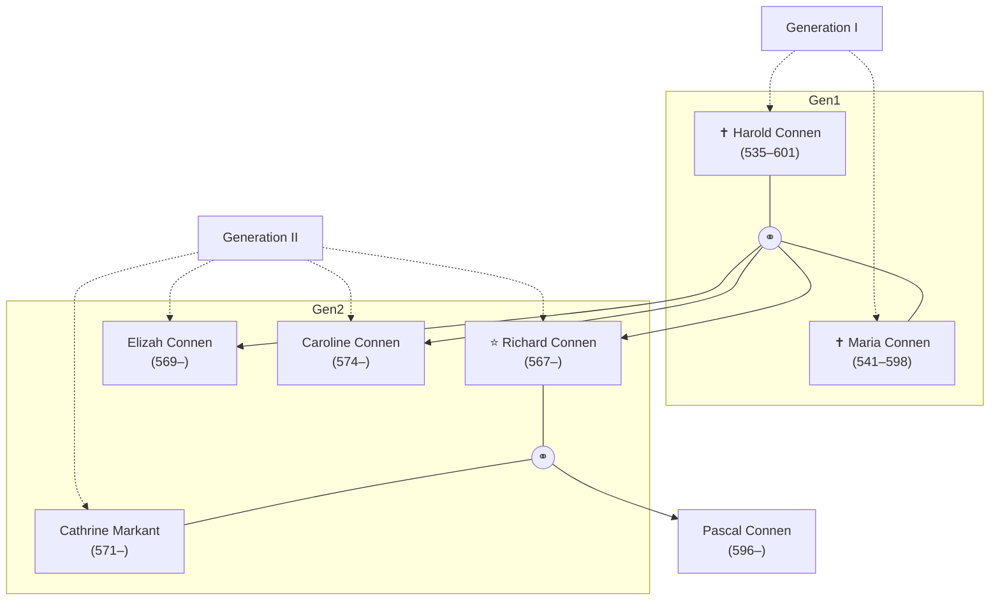

# Haus Connen

Familie aus Arden

## Stammbaum

```mermaid

flowchart TB

gen1["Generation I"]
gen2["Generation II"]

%% ===== Generation I (eine Zeile) =====
subgraph Gen1
direction LR
  harold_connen["✝ Harold Connen<br/>(535–601)"]
  e1((⚭))
  maria_connen["✝ Maria Connen<br/>(541–598)"]

  harold_connen --- e1
  e1 --- maria_connen
end

%% Generation-I-Label nur zur Optik (unsichtbare Verbindung)
gen1 -.-> harold_connen
gen1 -.-> maria_connen

%% Kinder aus Ehe 1
e1 --> richard_connen["⭐ Richard Connen<br/>(567–)"]
e1 --> elizah_connen["Elizah Connen<br/>(569–)"]
e1 --> caroline_connen["Caroline Connen<br/>(574–)"]

%% ===== Generation II (eine Zeile) =====
subgraph Gen2
direction LR
  richard_connen
  e2((⚭))
  cathrine_markant["Cathrine Markant<br/>(571–)"]
  elizah_connen
  caroline_connen

  richard_connen --- e2
  e2 --- cathrine_markant
end

%% Generation-II-Label nur zur Optik
gen2 -.-> richard_connen
gen2 -.-> elizah_connen
gen2 -.-> caroline_connen
gen2 -.-> cathrine_markant

%% Kind aus Ehe 2
e2 --> pascal_connen["Pascal Connen<br/>(596–)"]

%% Klickbare Links
click harold_connen "/charaktere/harold-connen"
click maria_connen "/charaktere/maria-connen"
click richard_connen "/charaktere/richard-connen"
click elizah_connen "/charaktere/elizah-connen"
click caroline_connen "/charaktere/caroline-connen"
click cathrine_markant "/charaktere/cathrine-markant"
click pascal_connen "/charaktere/pascal-connen"


```
